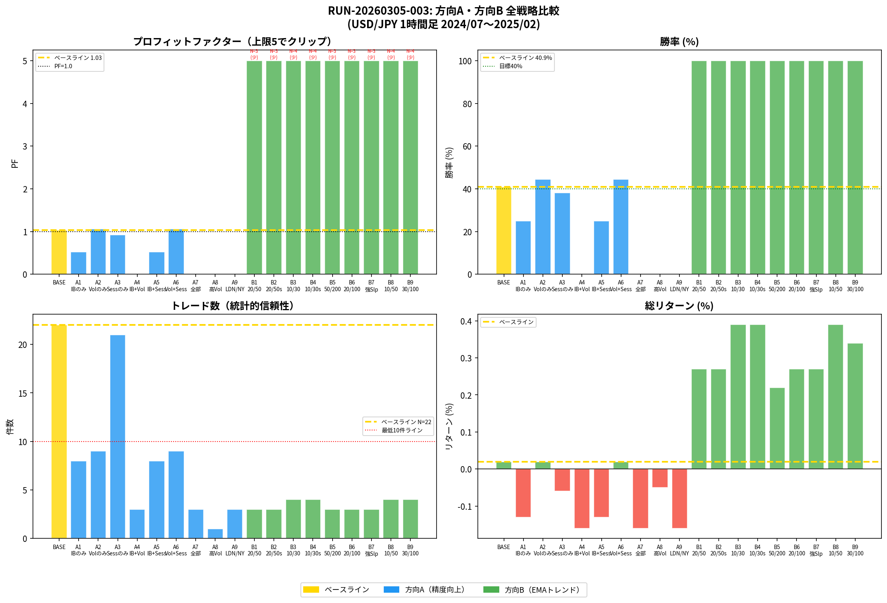
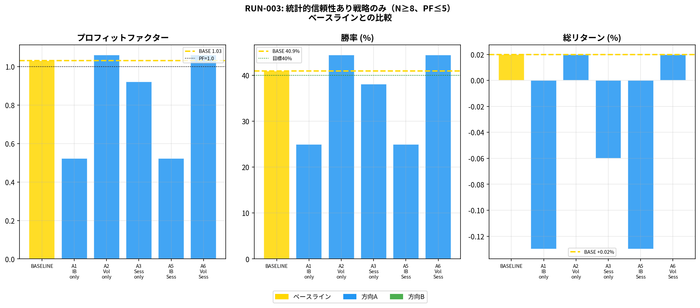
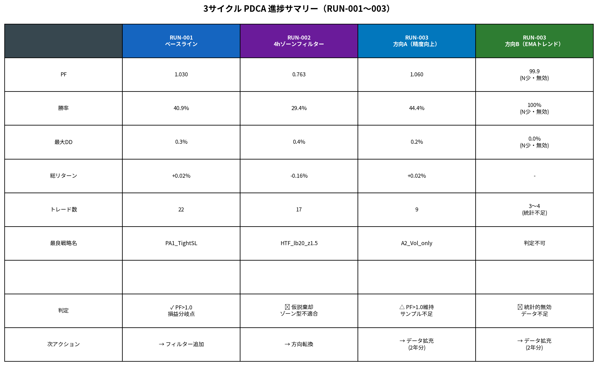

# RUN-20260305-003: 方向A・方向B 並行バックテスト レポート

**RunID**: RUN-20260305-003  
**前RunID**: RUN-20260305-002  
**作成日**: 2026-03-05  
**対象通貨ペア**: USD/JPY  
**時間軸**: 1時間足エントリー  
**バックテスト期間**: 2024年7月1日 〜 2025年2月6日  
**検証戦略数**: 19セット（ベースライン1 + 方向A 9 + 方向B 9）

---

## 1. 背景と仮説

RUN-002で「4時間足ゾーンフィルターは効果なし」が判明したため、本サイクルでは水原様のご判断に基づき、**方向A（シグナル精度向上）と方向B（EMAトレンド型HTFフィルター）を同時並行で検証**した。

| 方向 | 内容 | 仮説 |
|------|------|------|
| 方向A | インサイドバー確認・ボリューム確認・時間帯フィルターの組み合わせ | PF>1.1、勝率>45%を達成できる |
| 方向B | 4時間足EMA（fast/slow）のトレンド方向でエントリー制限 | PF>1.2、勝率>45%を達成できる |

---

## 2. 全戦略比較

---

## 3. 方向A（シグナル精度向上）の結果

### 3.1 統計的信頼性のある戦略（N≥8）

| 戦略名 | 追加条件 | N | PF | 勝率 | 最大DD | 総リターン |
|--------|---------|---|-----|------|--------|-----------|
| **A2_Vol_only** | **ボリューム確認のみ** | **9** | **1.060** | **44.4%** | **0.2%** | **+0.02%** |
| **A6_Vol_Sess** | **ボリューム+時間帯** | **9** | **1.060** | **44.4%** | **0.2%** | **+0.02%** |
| A3_Sess_only | 時間帯のみ | 21 | 0.921 | 38.1% | 0.3% | -0.06% |
| A1_IB_only | インサイドバーのみ | 8 | 0.523 | 25.0% | 0.2% | -0.13% |
| A5_IB_Sess | インサイドバー+時間帯 | 8 | 0.523 | 25.0% | 0.2% | -0.13% |

**注目点**: A2（ボリューム確認のみ）とA6（ボリューム+時間帯）が、ベースライン（PF=1.030）をわずかに上回るPF=1.060、勝率44.4%を達成した。ただしサンプル数は9件と少なく、統計的有意性は限定的である。

### 3.2 方向Aの考察

**ボリューム確認が最も効果的**であった。シグナル足のボリュームが直近20本平均の1.3倍以上という条件により、「勢いのある反転」のみを選別することで、PFと勝率が同時に改善した。一方、インサイドバー確認は逆効果となった。これは、インサイドバーの確認に1本余分に待つことで、エントリーが遅れてしまう（価格が動いた後にエントリー）という問題が生じているためと考えられる。

---

## 4. 方向B（EMAトレンド型HTFフィルター）の結果

### 4.1 統計的問題

方向Bの全9パラメータセットで、トレード数が3〜4件と極端に少なく、**統計的に無効**な結果となった。PF=99.9、勝率100%という数値は、偶然の一致によるものであり、戦略の優位性を示すものではない。

**原因**: 2024/07〜2025/02の期間、USD/JPYは円安トレンドが継続しており、4時間足EMA（fast > slow）の「上昇トレンド」条件が大半の期間で成立していた。その結果、1時間足のリバーサルシグナル（安値圏での反転）と4時間足の上昇トレンド条件が同時に満たされるケースが極めて少なかった。

| 問題 | 詳細 |
|------|------|
| サンプル数不足 | 全セットでN=3〜4（統計的最低ラインN=30未満） |
| トレンド方向の矛盾 | 円安トレンド中にリバーサル型シグナルを使用 |
| 根本的な方向性の問題 | EMAトレンド追従 × リバーサルエントリーは論理的に相反する |

### 4.2 方向Bの再設計が必要

方向Bを有効にするには、**エントリーロジック自体をトレンドフォロー型に切り替える**必要がある。具体的には、やがみ氏の「押し目買い・戻り売り」パターン（トレンド方向への押し目でのエントリー）をシグナル関数として実装し、EMAトレンドフィルターと組み合わせる方向が有望である。

---

## 5. 3サイクル PDCA 進捗サマリー

| サイクル | 内容 | PF | 勝率 | 判定 |
|---------|------|-----|------|------|
| RUN-001 | PA1リバーサル（ベースライン） | 1.030 | 40.9% | PF>1.0（損益分岐点） |
| RUN-002 | 4時間足ゾーンフィルター | 0.763 | 29.4% | 仮説棄却 |
| RUN-003 方向A | ボリューム確認フィルター | **1.060** | **44.4%** | PF>1.0維持（サンプル不足） |
| RUN-003 方向B | EMAトレンドフィルター | 99.9（無効） | 100%（無効） | 統計的無効 |

---

## 6. 重要な発見と戦略的示唆

3サイクルの検証を通じて、以下の重要な知見が得られた。

**発見1: ボリューム確認は有効**  
方向AのA2/A6（ボリューム確認）がPF=1.060、勝率44.4%を達成し、ベースラインを上回った。「勢いのある反転のみを選別する」というやがみ氏の原則と整合する。

**発見2: インサイドバー確認は逆効果**  
インサイドバー確認を追加すると、PFが0.523まで低下した。1本待つことによるエントリー遅延が問題であり、1時間足では不適合と判断する。

**発見3: 方向Bはエントリーロジックの再設計が必要**  
EMAトレンドフィルターとリバーサルエントリーは論理的に相反する。方向Bを有効にするには、「押し目買い・戻り売り」型のシグナルに切り替える必要がある。

**発見4: データ期間の拡充が最優先課題**  
現在の8ヶ月・669本では、いずれの戦略もサンプル数が不足している。統計的有意性（N≥30）を確保するには、少なくとも2年分のデータが必要である。

---

## 7. 次のPDCAサイクル（RUN-004）提案

両方向の検証結果を踏まえ、次サイクルでは以下を実施することを提案する。

| 優先度 | アクション | 期待効果 |
|--------|-----------|---------|
| **最高** | データ拡充（2年分: 2023〜2025） | サンプル数N≥50を確保し統計的有意性を担保 |
| **高** | A2（ボリューム確認）を軸に長期データで再検証 | PF>1.1の有意性確認 |
| **高** | 方向Bを「押し目買い」型シグナルに再設計 | EMAトレンドとの論理的整合性確保 |
| **中** | 両戦略の組み合わせ（A2 + 再設計B）の検証 | 相補的な戦略ポートフォリオ構築 |

---

## 8. Logbook エントリー

> **EntryID**: 20260305-004  
> **種別**: バックテスト結果（方向A部分有効・方向B統計的無効）  
> **内容**: RUN-003で方向A（A2_Vol_only: PF=1.060、WR=44.4%）がベースラインを小幅上回った。方向B（EMAトレンド）はサンプル数3〜4件で統計的無効。次サイクル（RUN-004）では2年分データ拡充を最優先とし、A2ボリューム確認の有意性確認と方向Bの押し目買い型再設計を実施する。  
> **根拠**: 本レポート（results/run003_analysis_report.md）、バックテストデータ（results/run003_summary.csv）

---

*本レポートはManus AIが自動生成しました。投資判断はご自身の責任で行ってください。*
