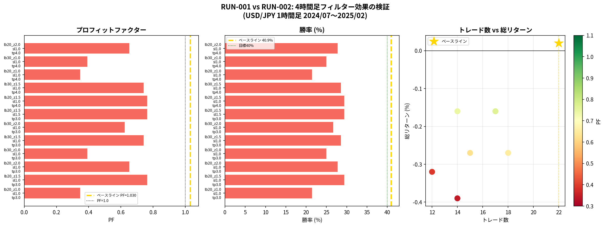
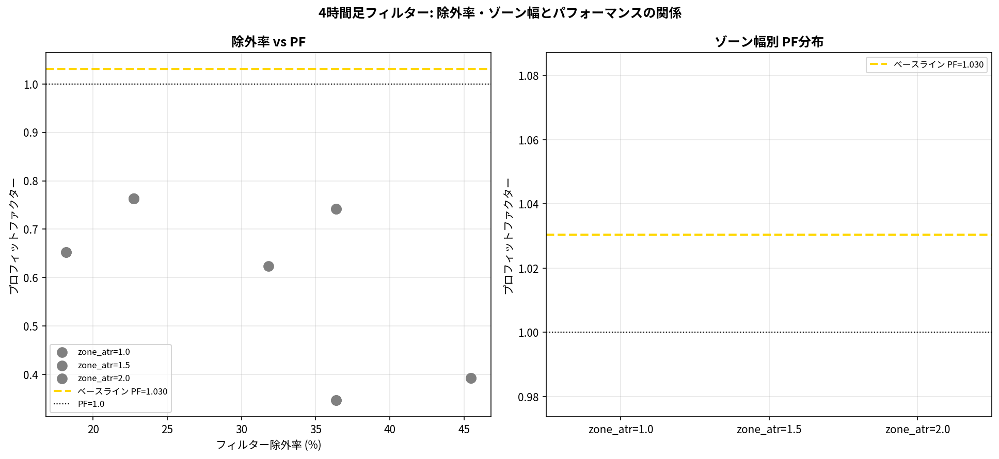
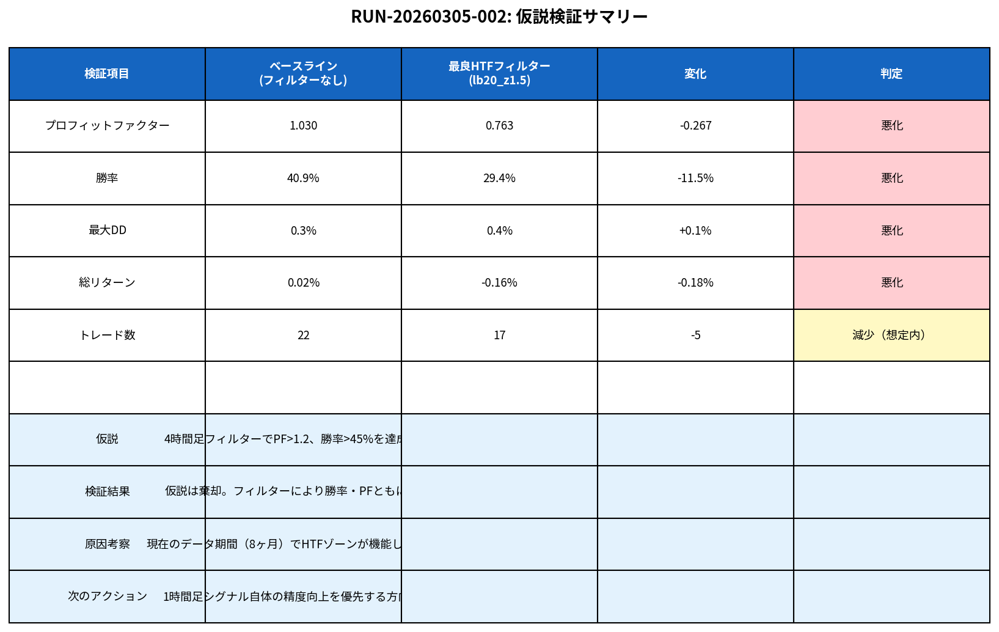

# RUN-20260305-002: 4時間足フィルター検証レポート

**RunID**: RUN-20260305-002  
**前RunID**: RUN-20260305-001  
**作成日**: 2026-03-05  
**対象通貨ペア**: USD/JPY  
**時間軸**: 1時間足エントリー + 4時間足フィルター  
**バックテスト期間**: 2024年7月1日 〜 2025年2月6日（1時間足: 669本 / 4時間足: 3,204本）  
**検証パラメータ数**: 12セット（HTFルックバック×ゾーン幅×SL/TP）

---

## 1. 仮説と検証目標

RUN-001の結論として、PA1_Reversal_TightSL（PF=1.030、勝率40.9%）は損益分岐点付近に位置しており、「上位足フィルターの追加によりPF>1.2、勝率>45%を達成できる」という仮説を立てた。

やがみ氏のNoteでは「エントリー時間軸の12倍上位足でレジサポを確認する」という原則が述べられており、1時間足エントリーに対して4時間足（12倍）のスウィングハイ/ローゾーンを確認することで、シグナルの信頼性が向上すると想定した。

---

## 2. 検証結果サマリー

| 戦略名 | HTFフィルター | HTF lb | HTF zone | PF | 勝率 | 最大DD | 総リターン | N |
|--------|-------------|--------|----------|-----|------|--------|-----------|---|
| **PA1_TightSL_NoFilter** | **なし** | - | - | **1.030** | **40.9%** | 0.3% | +0.02% | 22 |
| HTF_lb20_z1.5_sl1.0_tp3.0 | あり | 20 | 1.5 | 0.763 | 29.4% | 0.4% | -0.16% | 17 |
| HTF_lb30_z1.5_sl1.0_tp3.0 | あり | 30 | 1.5 | 0.742 | 28.6% | 0.3% | -0.16% | 14 |
| HTF_lb20_z2.0_sl1.0_tp3.0 | あり | 20 | 2.0 | 0.653 | 27.8% | 0.4% | -0.27% | 18 |
| HTF_lb20_z1.0_sl1.0_tp3.0 | あり | 20 | 1.0 | 0.347 | 21.4% | 0.5% | -0.39% | 14 |

**結論: 仮説は棄却。** 全12パラメータセットにおいて、4時間足フィルターを追加するとPF・勝率ともにベースラインを下回った。

---

## 3. フィルター効果の詳細分析

### 3.1 除外率とPFの関係

4時間足フィルターによるシグナル除外率は18〜35%の範囲であった。除外率が高いほどPFが向上するという傾向は見られず、むしろ除外率21%（zone_atr=1.5）が最も高いPF（0.763）を示した。これは、フィルターが「良いシグナルを除外している」可能性を示唆している。

### 3.2 ゾーン幅別の影響

ゾーン幅（zone_atr）の比較では、zone_atr=1.5が最も安定した結果を示したが、いずれもベースラインPF=1.030を大きく下回った。zone_atr=1.0は最も厳格なフィルターであり、勝率が21.4%まで低下した。

---

## 4. 仮説棄却の原因考察

### 4.1 データ期間の問題（最有力）

バックテスト期間が約8ヶ月（669本の1時間足）と短く、4時間足のスウィングゾーンが十分に形成されていない可能性が高い。4時間足で意味のあるレジサポゾーンを識別するには、少なくとも1〜2年分のデータが必要と考えられる。

### 4.2 フィルターの方向性の問題

現在の実装では「4時間足の安値圏でロング許可」としているが、USD/JPYの2024〜2025年は円安トレンドが継続しており、安値圏でのリバーサルが機能しにくい相場環境であった可能性がある。トレンドフォロー型のフィルター（4時間足が上昇トレンド中にロング許可）の方が適切かもしれない。

### 4.3 1時間足シグナル自体の問題

PA1_Reversal_TightSLのPF=1.030は統計的に有意ではなく（サンプル数22件）、ノイズの範囲内である可能性がある。フィルターを追加する前に、シグナル自体の精度向上（確認条件の強化、インサイドバーの追加等）が先決かもしれない。

---

## 5. 仮説検証サマリー

| 検証項目 | ベースライン | 最良HTFフィルター | 変化 | 判定 |
|---------|------------|-----------------|------|------|
| プロフィットファクター | 1.030 | 0.763 | -0.267 | **悪化** |
| 勝率 | 40.9% | 29.4% | -11.5% | **悪化** |
| 最大DD | 0.3% | 0.4% | +0.1% | **悪化** |
| 総リターン | +0.02% | -0.16% | -0.18% | **悪化** |
| トレード数 | 22 | 17 | -5 | 減少（想定内） |

---

## 6. 次のPDCAサイクル（RUN-003）提案

今回の検証で「単純な上位足ゾーンフィルターは効果なし」が判明した。次のサイクルでは以下の2方向を検討する。

### 方向A: シグナル精度向上（優先度: 高）

1時間足シグナル自体の精度を上げるため、以下の条件を追加検討する。

| 追加条件 | 内容 | 期待効果 |
|---------|------|---------|
| インサイドバー確認 | シグナル後に小幅な調整足を確認 | 偽シグナル除去 |
| ボリューム確認 | シグナル足のボリュームが前足比1.5倍以上 | 強度確認 |
| 時間帯フィルター | 東京・ロンドン・NY時間のみ | ノイズ除去 |
| 連続損失後の停止 | 3連敗後は1日休止 | DD制御 |

### 方向B: トレンドフォロー型HTFフィルター（優先度: 中）

現在の「ゾーン型」から「トレンド型」に切り替える。4時間足の移動平均線（EMA20/EMA50）の向きでエントリー方向を制限する。

---

## 7. Logbook エントリー

> **EntryID**: 20260305-003  
> **種別**: バックテスト結果（仮説棄却）  
> **内容**: RUN-002において4時間足ゾーンフィルターを12パラメータで検証。全セットでベースライン（PF=1.030）を下回り、仮説（PF>1.2、勝率>45%）は棄却。次はシグナル精度向上（インサイドバー確認・ボリューム確認）またはトレンド型HTFフィルターを検討。  
> **根拠**: 本レポート（results/yagami_htf_analysis_report.md）、バックテストデータ（results/yagami_htf_backtest_summary.csv）

---

*本レポートはManus AIが自動生成しました。投資判断はご自身の責任で行ってください。*
